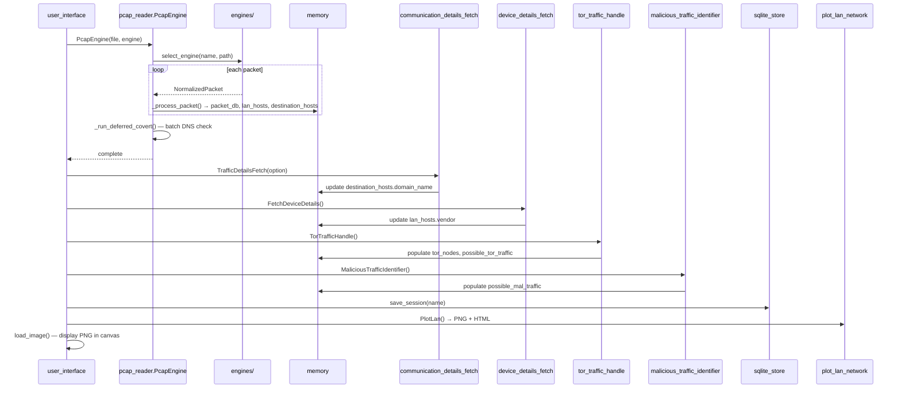
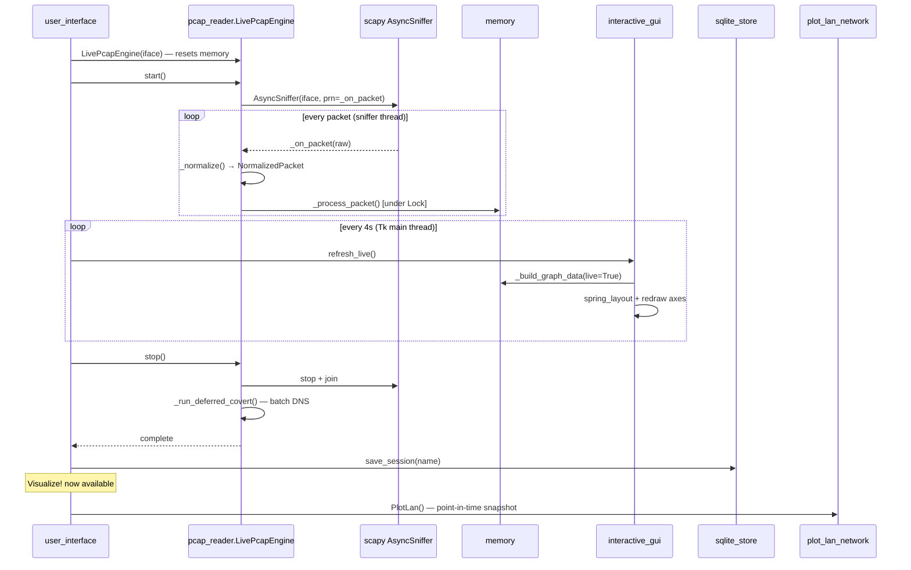
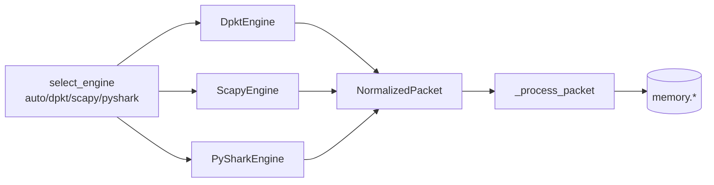
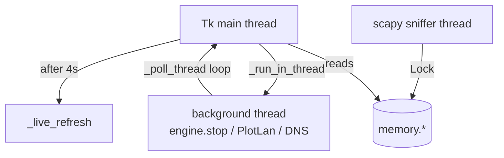

# PcapXray — Developer Reference

Architecture, call flows, threading model, and extension points.

---

## Repository Layout

```
PcapXray/
├── Source/
│   ├── main.py                        # Entry point
│   └── Module/
│       ├── user_interface.py          # Tkinter GUI controller
│       ├── interactive_gui.py         # Matplotlib panel (live + static)
│       ├── pcap_reader.py             # PcapEngine + LivePcapEngine
│       ├── memory.py                  # Shared state (Pydantic models)
│       ├── engines/                   # Pluggable PCAP parsers
│       │   ├── __init__.py            # select_engine()
│       │   ├── base.py                # NormalizedPacket + PacketEngine protocol
│       │   ├── scapy_engine.py        # TLS-aware streaming engine
│       │   ├── dpkt_engine.py         # Fast offline engine
│       │   └── pyshark_engine.py      # tshark-backed engine
│       ├── plot_lan_network.py        # Graphviz PNG + pyvis HTML
│       ├── communication_details_fetch.py  # DNS + whois
│       ├── device_details_fetch.py    # OUI vendor lookup
│       ├── tor_traffic_handle.py      # Tor consensus download + match
│       ├── malicious_traffic_identifier.py # Heuristic flagging
│       ├── sqlite_store.py            # Session persistence
│       └── report_generator.py       # Text report writer
├── Test/
│   ├── conftest.py
│   ├── test_unit.py
│   ├── test_sanity.py
│   ├── test_engines.py
│   ├── test_pcap_reader_module.py
│   └── test_sqlite_store.py
├── CLAUDE.md                          # Claude Code guidelines
├── DEV.md                             # This file
├── SECURITY.md                        # Security policy
└── tox.ini
```

---

## Global State — memory.py

All inter-module state lives as Pydantic models in plain dict containers:

| Container | Key | Value type | Description |
|---|---|---|---|
| `memory.packet_db` | `"src/dst/port"` | `PacketSession` | All captured sessions |
| `memory.lan_hosts` | MAC string | `LanHost` | Devices on the local network |
| `memory.destination_hosts` | IP string | `DestinationHost` | External/remote hosts |
| `memory.tor_nodes` | — | `list[tuple[str,int]]` | Tor consensus node list |
| `memory.possible_tor_traffic` | — | `list[str]` | Session keys flagged as Tor |
| `memory.possible_mal_traffic` | — | `list[str]` | Session keys flagged as malicious |

**Rule:** always use attribute access on model values (`session.covert`, `host.domain_name`). Never dict-style access.

Memory is the live source of truth. SQLite is persistence. The matplotlib panel and static graph both read from memory at render time.

---

## File Analysis Flow



---

## Live Capture Flow



---

## Pluggable Engine Architecture



All engines implement the `PacketEngine` protocol from `engines/base.py`:

```python
class PacketEngine(Protocol):
    def stream(self) -> Iterator[NormalizedPacket]: ...
```

`NormalizedPacket` is a dataclass with fields: `ip_version`, `src_ip`, `dst_ip`, `src_mac`, `dst_mac`, `proto`, `src_port`, `dst_port`, `payload_bytes`, `tls_records`, `dns_qname`, `icmp_tunneled`.

### Adding a new engine

1. Create `engines/your_engine.py` implementing `stream() -> Iterator[NormalizedPacket]`
2. Register it in `engines/__init__.py` inside `select_engine()`
3. Add `skipif` tests to `Test/test_engines.py` following the dpkt pattern

---

## Threading Model



- `LivePcapEngine._on_packet` runs in scapy's sniffer thread; all `memory.*` mutations are protected by `self._lock`
- All blocking operations (DNS, graphviz render, covert check) run via `_run_in_thread` + `_poll_thread` to keep the Tk main thread responsive
- `_live_refresh` reads from memory on the Tk main thread — safe because it only reads, never writes

---

## Session Key Format

```
"src_ip/dst_ip/port"
```

- TCP/UDP private→public: `"192.168.1.10/8.8.8.8/443"`
- ICMP: `"192.168.1.10/8.8.8.8/ICMP"`
- Both private: bidirectional dedup — key2 reused if it already exists

---

## Covert Channel Detection

Two-stage:

1. **Inline** (during packet loop): ICMP with tunneled payload → `session.covert = True` immediately. DNS qnames with >8 digits → `session.covert = True` immediately.
2. **Deferred** (`_run_deferred_covert`): DNS qnames queued during capture are batch-resolved after the loop ends. Unresolvable qnames → `session.covert = True`. Deduplicated by qname — one DNS call per unique qname regardless of session count. Hard cap: 10s wall-clock timeout.

---

## SQLite Session Cache

`sqlite_store.SqliteStore` serialises all `memory.*` state to a local SQLite database. On next open, if a matching session exists the UI offers to load from cache (skipping re-analysis). Live capture sessions are saved automatically on stop with a timestamp-based name: `live_{iface}_{timestamp}`.

---

## Test Layout

| File | Coverage |
|------|---------|
| `test_unit.py` | Per-module unit tests, mocked network/OUI/Tor |
| `test_sanity.py` | End-to-end smoke tests against real PCAP files |
| `test_pcap_reader_module.py` | PcapEngine standalone smoke test |
| `test_engines.py` | NormalizedPacket, all engines, `_process_packet`, `LivePcapEngine` lifecycle |
| `test_sqlite_store.py` | Session persistence and reload |

Run with `pytest -m "not network" Test/` to skip tests that make real DNS/Tor calls.

---

## Environment Variables

| Variable | Effect |
|----------|--------|
| `PCAPXRAY_DEBUG=1` | Enable DEBUG log level |

Log file: `~/PcapXray.log` (overwritten each run).
