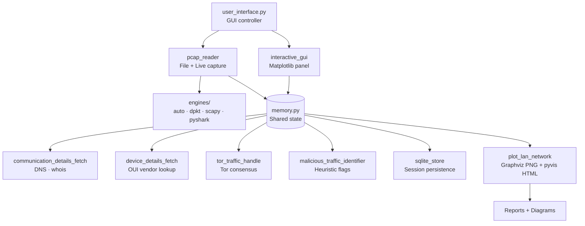
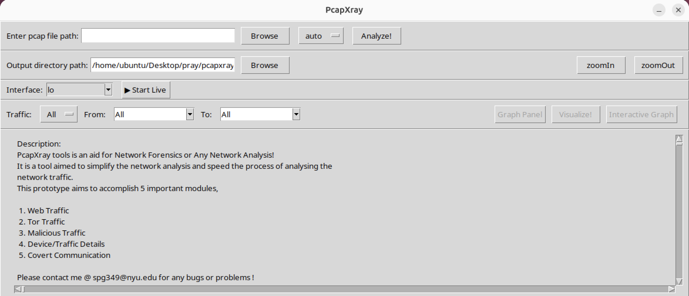
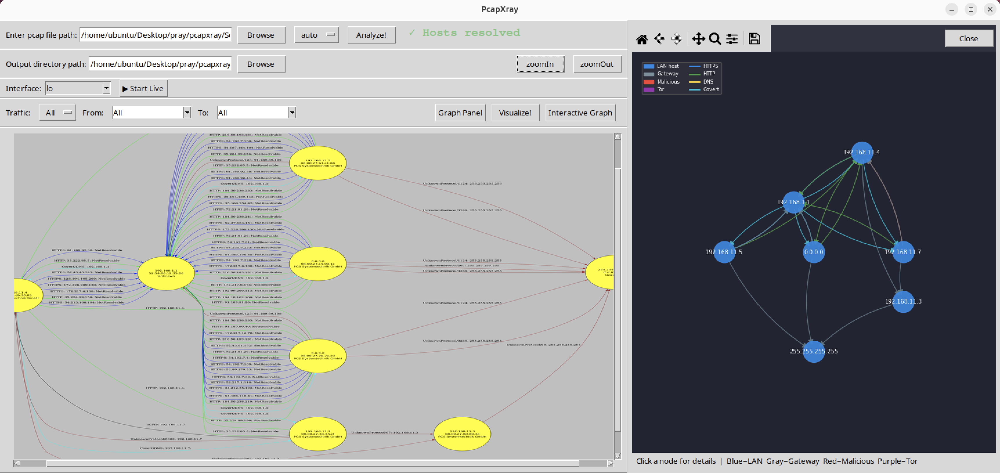

# PcapXray [](https://github.com/srixivas/PcapXray/actions/workflows/test.yml) [](https://codecov.io/gh/srixivas/PcapXray) [](https://www.defcon.org/html/defcon-27/dc-27-demolabs.html#PcapXray)

A network forensics tool — visualize PCAP files or live traffic as an annotated network diagram with device identification, protocol classification, Tor detection, and malicious traffic flagging.


---

## Module Overview



---

## Design Specification

### Goal
Given a PCAP file or a live network interface, plot a network diagram displaying hosts, traffic flows, important/Tor/malicious communication, and data involved in each session.

### Problem
- Investigation of a PCAP file takes a long time given the initial glitch to start the investigation
- Faced by every forensics investigator and anyone analyzing network traffic

### Solution: Speed up the investigation process
Make a network diagram with the following features:

**Tool Highlights:**
- Network Diagram — summary network diagram of the full network
- Web traffic with server details
- Tor traffic detection
- Possible malicious traffic flagging
- Data obtained from packets in report — device/traffic/payloads
- Device details — OUI vendor, hostname resolution, whois
- Live traffic capture with real-time graph updates
- Interactive graph — pyvis HTML for in-browser exploration
- Session persistence — SQLite cache for reload without re-analysis

---

## Screenshots

*Main application panel*


*Static network graph with interactive matplotlib panel*


---

## Demo

<!-- Replace with v5.1 GIF showing live capture + static graph -->


---

## Setup

**Requirements: Python 3.10+**

### Linux (Ubuntu/Debian)
```bash
sudo apt-get update
sudo apt-get install -y python3-tk graphviz tshark
pip3 install -r requirements.txt
sudo python3 Source/main.py
```

> If using a specific Python version (3.11, 3.12), replace `python3-tk` with `python3.11-tk` or `python3.12-tk`. Install Pillow via pip only — do not install `python3-pil` from apt as it conflicts.

### macOS
```bash
brew install graphviz
pip3 install -r requirements.txt
sudo python3 Source/main.py
```

> `sudo` is required for live capture. File analysis runs without it.

---

## Usage

### File analysis
1. Enter or browse to a `.pcap` / `.pcapng` file
2. Choose output directory
3. Select engine (default: `auto`)
4. Click **Analyze!**
5. Click **Visualize!** to generate the network diagram
6. Click **Interactive Graph** to open the pyvis HTML in your browser
7. Click **Graph Panel** to open the matplotlib interactive view

### Live capture
1. Select your network interface from the dropdown
2. Click **▶ Start Live** (requires `sudo` / root)
3. The graph panel opens and updates every 4 seconds
4. Click **⏹ Stop** to end capture — runs covert channel detection post-capture
5. Click **Visualize!** to generate a point-in-time static snapshot

---

## PCAP Engines

PcapXray supports four interchangeable parsing backends selectable from the toolbar:

| Engine | Best for | Notes |
|--------|----------|-------|
| `auto` | General use | Tries dpkt first, falls back to scapy |
| `dpkt` | Large files, low memory | Fast offline parsing |
| `scapy` | Deep protocol inspection | TLS-aware, slower on large files |
| `pyshark` | Maximum protocol coverage | Requires tshark installed |

---

## Components

- **Network Diagram** — graphviz-rendered PNG of the full LAN topology
- **Device/Traffic Details and Analysis** — per-session payloads, TLS records, DNS queries
- **Malicious Traffic Identification** — port and domain heuristic-based flagging
- **Tor Traffic** — consensus download + session matching
- **Live Capture** — AsyncSniffer with real-time matplotlib graph, 4-second refresh
- **GUI** — Tkinter interface with filter options, zoom, and session controls

---

## Python Libraries

All dependencies are in `requirements.txt` — install with `pip3 install -r requirements.txt`.
Tkinter is the only library not on PyPI — install via your system package manager (`python3-tk` on Linux, included with Python on macOS).

| Library | Purpose |
|---------|---------|
| scapy | Packet reading and live capture |
| dpkt | Fast PCAP parsing engine |
| pyshark | tshark-backed parsing engine |
| ipwhois | Whois / RDAP lookup |
| netaddr | IP address classification |
| pillow | Image processing for graph display |
| stem | Tor consensus data fetch |
| graphviz | Network diagram rendering |
| networkx | Graph construction and layout |
| matplotlib | Embedded interactive graph panel |
| pyvis | Interactive HTML network graph |
| pydantic | Typed data models for session state |
| cryptography | TLS cipher suite parsing |

---

## Development & Architecture

See [DEV.md](DEV.md) for full architecture documentation, call flow diagrams, module responsibilities, threading model, and how to add a new engine.

---

## Security

See [SECURITY.md](SECURITY.md) for responsible disclosure, security posture, and known limitations.

---

## Testing

```bash
# Fast suite — no network calls
pytest -m "not network" Test/

# Full suite including real DNS + Tor
pytest Test/

# Isolated engine environments
tox
tox -e all-engines
```

96+ tests across Python 3.10, 3.11, 3.12.

---

## Additional Information

- Tested on macOS and Linux
- Traffic filter options: All, HTTP, HTTPS, Tor, Malicious, ICMP, DNS
- Presented at DEF CON 27 Demo Labs

---

## Known Limitations

- **macOS minimize restore** — clicking the dock icon after minimizing may not restore the window due to a known Tk/Cocoa bug. Use Cmd+Tab or right-click the dock icon → Show as a workaround.
- **Large captures** — memory usage scales with session count; very large PCAPs (1GB+) may be slow. Use `dpkt` engine for best performance on large files.
- **Live capture privileges** — requires root/sudo on all platforms for raw socket access.

---

## Future

- More protocol support (QUIC, HTTP/2, mDNS)
- Web UI / eBPF engine
- Go rewrite for PacketTotal-scale performance

---

## Credits

- Professor Marc Budofsky
- Kevin Gallagher
- All contributors and dependent library authors
- Logo: logomakr.com + inkscape.org
- Presented at DEF CON 27 Demo Labs

## ***Just for Security Fun!***
